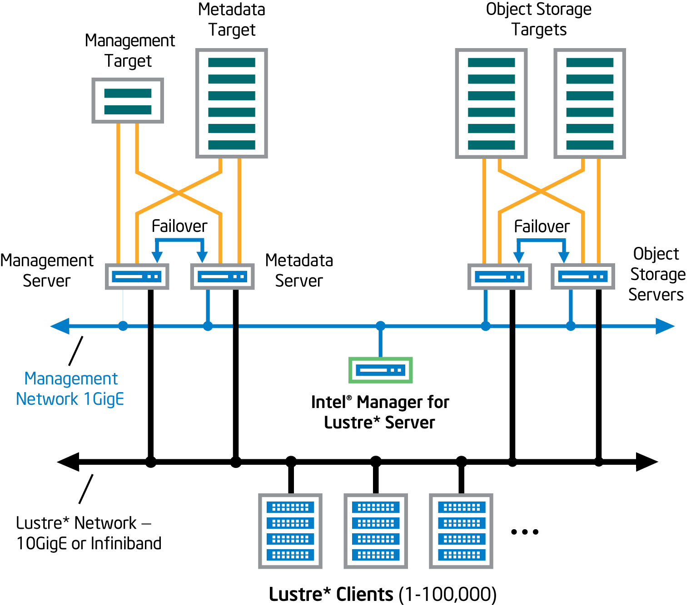
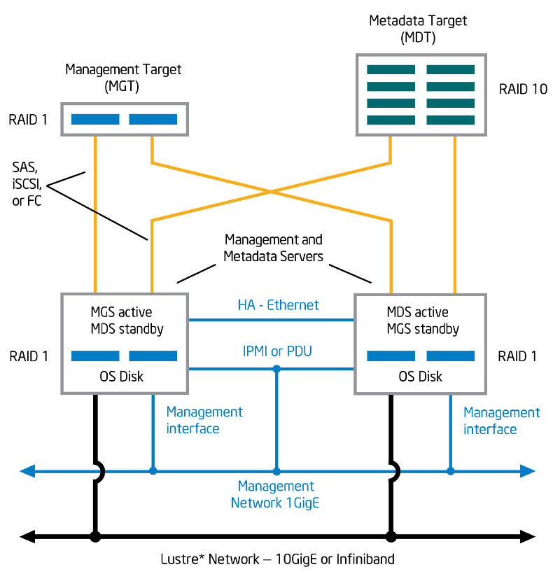

# Building the System – The High Availability Configuration Spec

[**Software Installation Guide Table of Contents**](ig_TOC.md)

**In this Chapter:**

- [Overall System Configuration](#overall-system-configuration)
- [Manager Server Requirements](#manager-server-requirements)
- [Management Server and Metadata Server Requirements](#management-server-and-metadata-server-requirements)
- [Management Target](#management-target)
- [Metadata Target](#metadata-target)
- [Object Storage Server and Target Requirements](#object-storage-server-and-target-requirements)
- [Power Control to Support Failover](#power-control-to-support-failover)
- [Intelligent Platform Management Interface](#intelligent-platform-management-interface)
- [Power Distribution Units](#power-distribution-units)
- [Issues Regarding Power Loss to the BMC or PDU](#issues-regarding-power-loss-to-the-bmc-or-pdu)

A high-availability Lustre* file system managed by Intel® Manager for Lustre* software
requires that your entire storage system configuration
and all interfaces comply with the High Availability Configuration
Specification presented in this chapter.

If you are creating a Lustre* file system that will use OpenZFS as the
backend, see the guide *Lustre\* Installation and Configuration using
Intel® Manager for Lustre* software and OpenZFS*.

Overall System Configuration
----------------------------

The high-level configuration of an HA file system managed by Manager
for Lustre\* software consists of the following. See Figure 1.

-   A **dedicated manager server** hosts the Intel® Manager for Lustre* software and dashboard.

-   **Management server** (MGS): The MGS provides access to the
    management target (MGT) storage. To support failover, the management
    server is also configured as the backup for the metadata server.

-   **Metadata server** (MDS): The MDS provides access to the metadata
    target storage. To support failover, the metadata server is also
    configured as the backup management server.

-   **Object storage server** (OSS): At least two servers provide access
    to the object storage targets, which store the file system’s data.
    OSSs are configured in failover pairs sharing access to the same
    data storage, so that if an OSS fails, service is automatically
    failed over to its peer server.

-   **Management target** (MGT): The MGT stores configuration
    information for all the Lustre* file systems in a cluster and
    provides this information to other Lustre* components. The MGT is
    accessed by the primary MGS and, if the MGS fails, by the MDS
    operating in failover mode. The MGT should *not* be larger than 10
    Gbyte in capacity.

-   **Metadata target** (MDT): The MDT stores metadata (such as file
    names, directories, permissions, and file layout) for attached
    storage and makes them available to clients. The MDT is accessed by
    the primary MDS and, if the MDS fails, by the MGS operating in
    failover mode.

-   **Object storage targets** (OSTs): Client file system data is stored
    in one or more objects that are located on separate OSTs. The number
    of objects per file is configurable by the user and can be tuned to
    optimize performance for a given workload. RAID 6 is recommended for
    OSTs. RAID is implemented independent of Intel® Manager for Lustre* software.
    Note that Logical Volume Manager (LVM) *is not*
    supported in [Management mode](ig_ch_02_introduction.md/#what-is-management-mode), but *is*
    supported in [Monitor mode](ig_ch_02_introduction.md/#what-is-monitor-only-mode). Software
    RAID (MDRAID) disk discovery is not supported.

-   **Failover/High Availability ring 1 network**: This network supports
    Pacemaker and Corosync and requires an IP address block within the
    10/8 RFC-1918 private IP address space. Should you choose to utilize
    the 10/8 address block for the management/ring0 network as well,
    then the largest permissible network size that may be used for the
    management network (ring0) is /9, since the High Availability ring1
    network must co-exist within the 10/8 address space as well.
    Additionally, because the 10/8 network is used for the High
    Availability ring1 network and it must be of equal size to the
    management/ring0 network, the largest management/ring0 network you
    can define is a /9. Sizes larger than /9 are unsupported. Given
    those restrictions, if you require a /8 address block for your
    management network, you will be unable to utilize the RFC 1918
    private IP addressing space (i.e. 10/8) and must choose another /8
    network.

-   **Management network**: The Management network is 1-gigabit
    Ethernet, connecting every server in the file system. This network
    is used with ssh, to install and update Intel® Manager for Lustre* software
    on each server. It is also used to manage the
    servers and make separate connections to an IPMI port installed on
    each managed server.

-   **Lustre* network**: Generally, the Lustre* network (LNET) is either
    10-gigabit Ethernet or Infiniband and provides high-speed file
    system access for each client. The required data rate of this
    network is generally driven by the file system size, the number of
    clients, and the average throughput requirements for each client.

**Note**: After you have completely configured the system and installed
Intel® Manager for Lustre* software on the manager server, you will be
ready to create the Lustre* file system using the Intel® Manager for Lustre* software.
**Note that installation consists of installing
Intel® Manager for Lustre* software on the manager server only**. For HA
file systems, the software automatically installs required packages on
the file system’s servers to support HA. This avoids the need to
manually install the Intel® Manager for Lustre* software on storage
servers and avoids possible errors.

During this physical configuration of your file system hardware, be sure
to write down how servers and storage are configured so you can later
assign primary and failover servers to each volume (using the
Intel® Manager for Lustre* software GUI). Also, keep records of how failover
power control has been implemented (IPMI or PDUs) as this will be needed
later.

The following figure shows the high-level HA system configuration.

**Note**: All references herein to the *manager GUI* refer to the
Intel® Manager for Lustre* software graphical user interface.

Manager Server Requirements
---------------------------

The *manager server* is a dedicated server on which the Manager
for Lustre\* software is installed. This is unique from the *management*
*server*. Requirements for the manager server are listed next.

**Note**: Before using the Red Hat or RHEL software referenced herein,
please refer to Red Hat’s website for more information, including
without limitation, information regarding the mitigation of potential
security vulnerabilities in the Red Hat software.

-   X86 CPU

-   At *least* 4 GB of RAM

-   Storage on the server large enough to accommodate:

    -   24 GB for the operating system and additional packages

    -   Swap space equal to twice the available RAM present

    -   a base OS installation that provides **at least a 500-GB /var
        partition**

-   A one gigabit Ethernet port to connect to the management network.

-   RAID 1 is a minimum recommendation. RAID 10 may be optimal for heavy
    workloads. Software RAID (MDRAID) disk discovery is not supported.

-   Red Hat Enterprise Linux or CentOS Linux, version {{site.centos_version}} must be
    installed on all servers. All Lustre* servers should be running the
    same OS and version. CentOS must have access to the base
    repositories and update repositories. Red Hat must have the
    following channels registered and enabled:

    -   rhel-x86\_64-server-supplementary-7

    -   rhel-x86\_64-server-optional-7

    -   rhel-x86\_64-server-ha-7

    -   rhel-x86\_64-server-7

-   yum needs to be functional (with any needed proxies) and default yum
    repositories must be fully configured. Run yum update to verify that
    yum updates occur successfully.

 Manager for Lustre\* software is supported on:

-   Latest released Google Chrome browser.

-   Latest released Mozilla Foundation Firefox browser.

Management Server and Metadata Server Requirements
--------------------------------------------------

The management server (MGS) is configured as a failover server with the
metadata server (MDS), and vice-versa, so the MGS and MDS share the same
configuration requirements.

**Note**: The MGS is separate from the independent server running
Intel® Manager for Lustre* software.

The following figure depicts the configuration, interconnect requirements and
targets for the MGS and MDS.

The MDS and MGS, both independent servers, share the following
requirements.

-   X86 CPU

-   MDS and MGS memory requirements are determined by factors such as
    the number of clients, the sizes of directories, and the load placed
    on the server. See the *Lustre\* {{site.lustre_version}} File System Operations Manual,
    Chapter 5, Determining Hardware Configuration Requirements and
    Formatting Options* for more information.

-   Red Hat Enterprise Linux or CentOS Linux version {{site.centos_version}} must be
    installed. All Lustre* servers should be running the same OS and
    version. CentOS must have access to the base repositories and update
    repositories. Red Hat must have the following channels registered
    and enabled:

    -   rhel-x86\_64-server-supplementary-7

    -   rhel-x86\_64-server-optional-7

    -   rhel-x86\_64-server-ha-7

    -   rhel-x86\_64-server-7

-   A dedicated Ethernet port capable of one gigabit/sec. This port connects to the Management network.
- yum needs to be functional, with any needed proxies, and default yum repositories must be fully configured. Run yum update to verify that yum updates occur successfully.
- HA servers are configured in pairs, with a primary server and a failover server.
- Crossover cable – Each HA server (excluding the manager server) is  connected to its peer HA server by a private crossover link. This is an Ethernet connection.
- All required multipath configuration between each storage server controller and its physical storage devices must be complete.
- Storage controllers and drives must already be installed and LUNs must already be configured and present.
-  Each server of a failover pair must have access to exactly the same LUNs as its peer. Each LUN is visible only to its two, paired failover servers.
- For proper failover functionality, paired servers must be able to access the other’s power control device. This can be implemented either using power distribution units (PDUs) or IPMI. Recommended PDUs are from American Power Conversion Corp., models AP7900, AP7901, AP7902, AP7920, AP7921, AP7930, AP7931, AP7932, AP7960, AP7990, and AP8941. Each server should be supplied with two power supply sources, for redundancy.

Management Target
-----------------

-   For comparatively small file systems, the typical management target capacity might be 100 MB. See the *Lustre\* {{site.lustre_version}} File System Operations Manual, Chapter 5, Setting up a Lustre* File System* for more information.
- Intel® Manager for Lustre* software does *not* support an MGT larger than 10 Gbytes.
- RAID 1 is recommended. Software RAID (MDRAID) disk discovery is not supported.
- As described above, the MGS and MDS servers are connected to the management storage in a primary/failover configuration.
- All required multipath configuration between each storage server controller and its physical storage devices must be complete.

Metadata Target
---------------

-   Storage capacity for the metadata target should be 2K bytes per storage system file. Multiply the anticipated number of files the file system will contain by 2K to determine the required capacity of the target. See the *Lustre\* {{site.lustre_version}} File System Operations Manual, Chapter 5, Setting up a Lustre* File System* for more information.
- RAID 10 is recommended for metadata targets. Software RAID (MDRAID) disk discovery is not supported.
- As described above, the MGS and MDS servers are connected to metadata storage in a primary/failover configuration.
- All required multipath configuration between each storage server controller and its physical storage devices must be complete.

Object Storage Server and Target Requirements
---------------------------------------------

The object storage server (OSS) provides access to the object storage target(s) (OST). There is no specific limit to the number of OSSs. For HA, each OSS must have a failover twin. This means that OSSs are paired. Each OSS pair can provide access for to up to 8 targets or LUNS. The maximum capacity for an OST is 128 terabytes. Figure 3 depicts the configuration and interconnect requirements for HA OSSs and OSTs. See the *Lustre\* {{site.lustre_version}} File System Operations Manual, Chapter 5, Setting up a Lustre* File System* for more information.

**Object Storage Server(s) and Target(s) Configuration**

Requirements for HA object storage servers and targets are as follows:

-   Red Hat Enterprise Linux or CentOS Linux version {{site.centos_version}} must be installed. All Lustre* servers should be running the same OS and version. CentOS must have access to the base repositories and update repositories. Red Hat must have the following channels registered and enabled:
    - rhel-x86\_64-server-supplementary-7
    - rhel-x86\_64-server-optional-7
    - rhel-x86\_64-server-ha-7
    - rhel-x86\_64-server-7

-   A storage device of at least 6 GB on each server to store the operating system and additional packages. Generally, OSS and OST space requirements are driven by the total size of the file system, the number of servers and OST, the number of files in the file system and the file size. See the Lustre\* {{site.lustre_version}} File System Operations Manual, Chapter 5, Setting up a Lustre* File System for more information.
-  A dedicated Ethernet port capable of one gigabit/sec. This port connects to the Management network.
- yum needs to be functional, with any needed proxies, and default yum repositories must be fully configured. Run yum update to verify that yum updates occur successfully.
- HA servers are configured in pairs, with a primary server and a failover server.
- Crossover cable – Each HA server (excluding the manager server) is connected to its peer HA server by a private crossover link. This is an Ethernet connection.
- Any required multipath configuration between each storage server controller and its physical storage devices must be complete.
- Storage controllers and drives must already be installed and LUNs must already be configured and present.
- Each server of a failover pair must have access to exactly the same LUNs as its peer. Each LUN is visible only to its two, paired failover servers.
- For proper failover functionality, paired servers must be able to access the other’s power control device. This can be implemented using power distribution units (PDUs) or by using IPMI. Recommended PDUs are from American Power Conversion Corp., models AP7900, AP7901, AP7902, AP7920, AP7921, AP7930, AP7931, AP7932, AP7960, and AP7990. Each server should be supplied with two power supply sources, for redundancy.
- RAID 6, n+2 is recommended for object storage targets. For optimal write performance, n should be a power of 2 (e.g. 4, 8, or 16). This helps to ensure that a full stripe write of 1 MB can be spread evenly across all disks in the volume, with no “read, modify, write” penalty. Note that Logical Volume Manager (LVM) is not supported in [Management mode](ig_ch_02_introduction.md/#what-is-management-mode), but is supported in [Monitor mode](ig_ch_02_introduction.md/#what-is-monitor-only-mode). Software RAID (MDRAID) disk discovery is not supported.
- There is no specific limit to the number of object storage servers, but each OSS should support no more than eight target storage devices.

Power Control to Support Failover
---------------------------------

High availability requires the ability to shut down a failing server so
that it will not interfere with file system operations, allowing the
backup (failover) server to assume its role. This control can be
provided by using power distribution units (PDUs) or IPMI. To comply
with this High Availability Configuration Specification, you must use
either PDU control or IPMI, but not both.

### Intelligent Platform Management Interface

High availability requires that you configure IPMI *or* power
distribution units to support failover. The Intelligent Platform
Management Interface (IPMI) enables server failover support. For this
configuration, each managed server requires an IPMI controller that
connects directly to the management network via a dedicated Ethernet
port. A failing HA server is automatically power-cycled and access to
its target storage devices is provided by the backup server.
Power-cycling the failed server forces it to relinquish control of its
resources and allows administrators to troubleshoot it.

After the failed server is repaired and ready for return-to-service, it
is *not* automatically brought back online as the primary server
(failed-back). Fail-back is performed manually, by the administrator at
the Intel® Manager for Lustre* software GUI.

**Note**: See [Issues Regarding Power Loss to the BMC or
PDU](#issues-regarding-power-loss-to-the-bmc-or-pdu)

After you have connected and configured IPMI, see [Appendix A, IPMI
Checks](ig_ch_13_appA_IPMI.md).

### Power Distribution Units

High availability requires that you configure IPMI *or* power
distribution units to support failover. Power distribution units (PDUs)
can be used to give control over the power supplied to a HA server to
its peer server. If one server of an HA pair detects the failure of its
peer server, the detecting server turns off power to the PDU outlets
connected to the failing server. If you chose to use PDUs for power
control, be sure to note which PDUs and outlets are connected to which
servers. Also, for redundancy, be sure that the primary and backup power
outlets connected to each server reside on different PDUs. After
configuring PDUs and noting PDU/server assignments, you will later
configure these assignments on theIntel® Manager for Lustre* software Power
Control tab.

**Note**: See [Issues Regarding Power Loss to the BMC or
PDU](#issues-regarding-power-loss-to-the-bmc-or-pdu)

### Issues Regarding Power Loss to the BMC or PDU

Regarding failover, if the method of power control is not functioning
(e.g., loss of power to the fencing device, misconfiguration, etc.), HA
will be unable to fail the targets from the failed server to its
failover server. This is because in order to complete failover, the
failover server must be able to guarantee that the failed server can no
longer access targets running on it. The only way to be sure this is
true is to remove power from the failed server. Thus, the failover
server must be able to communicate with the fencing device of the failed
server for failover to occur successfully.

With IPMI, the power for each HA server and its fencing device is
coupled together. Accordingly, there are more scenarios where both may
lose power at once (chassis power failure, motherboard failure, etc.).
If a server suffers chassis power failure such that the BMC is not
operational, HA will be unable to fail the targets over. The remedy in
this situation is to restore power to the chassis of the failed server
to restore the functionality of your file system. If HA coverage for the
scenarios just described is important to you, we strongly recommend
using smart PDUs, rather than IPMI as your fencing device.

Power loss to a PDU will mean that HA will be unable to fail the targets
over. As in the above situation, the remedy is to restore power to the
PDU to restore the functionality of your file system. We recommend
redundant PDUs if availability is critical.

[Top of page](#1.0)