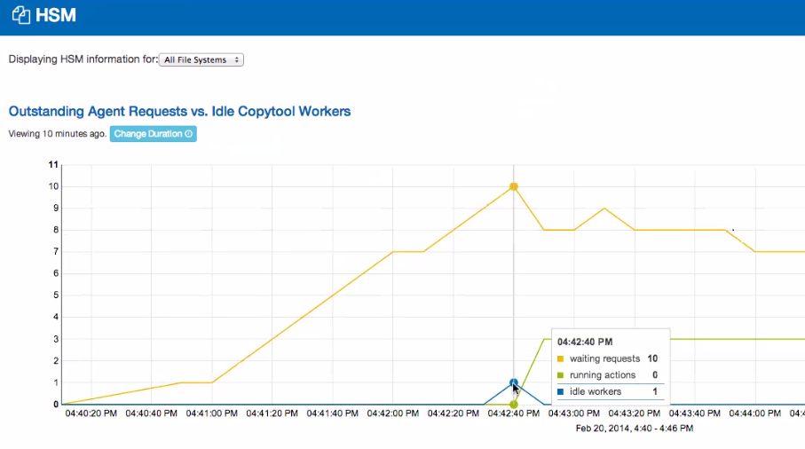

# Monitoring Lustre* file systems

[**Online Help Table of Contents**](IML_Help_TOC.md)

You can easily monitor one or more file systems at the Dashboard, Status, and Logs windows. The Dashboard window displays a set of charts that provide usage and performance data at several levels in the file systems being monitored, while the Status and Logs windows keep you informed of file system activity relevant to current and past file system health and performance.

**In this section:**

- [View charts on the Dashboard](#view-charts-on-the-dashboard)
  - [View charts for one or all file systems (including all OSTs, MDTs, and servers)](#view-charts-for-one-or-all-file-systems)
  - [View charts for all servers combined](#view-charts-for-all-servers-combined)
  - [View charts for an individual server](#view-charts-for-an-individual-server)
  - [View charts for an OST or MDT](#view-charts-for-an-ost-or-mdt)
- [Check file systems status](#check-file-systems-status)
- [View job stats](#view-job-stats)
- [View and manage file system parameters](#view-and-manage-file-system-parameters)
- [View a servers detail window](#view-a-servers-detail-window)
- [View commands and status messages on the Status window](#view-commands-and-status-messages-on-the-status-window)
- [View Logs](#view-logs)
- [View HSM Copytool activities](#view-hsm-copytool-activities)

## View charts on the Dashboard

The Dashboard displays a set of graphical charts that provide real-time usage and performance data at several levels in the file systems being monitored. All Dashboards' charts are available for both monitored-only and managed/monitored file systems.

At the top, the Dashboard lists the file system(s) being managed or monitored-only. The following information is provided for each file system:

- **File System:** The name assigned to this file system during its creation on the Configuration window.
- **Type:** Monitored or Managed. Managed file systems are configured and managed for high availability (HA). Managed file systems are both monitored and managed, whereas monitored file systems are monitored-only and do not support failover via Intel® Manager for Lustre* software.
- **Space Used / Total:** This indicates the amount of file system capacity consumed, versus the total file system capacity.
- **Files Used / Total:** This indicates the total number of inodes consumed by file creation versus the total number of inodes established for this file system.
- **Clients:** Indicates the number of clients accessing the file system at this moment.

### Persistent Chart Configuration

You can configure certain data display parameters for each chart, and your chart configuration will persist until you reload/refresh the Dashboard page, using the browser.

See:

- [View charts for one or all file systems (including all OSTs, MDTs, and servers)](#view-charts-for-one-or-all-file-systems)
- [View charts for all servers combined](#view-charts-for-all-servers-combined)
- [View charts for an individual server](#view-charts-for-an-individual-server)
- [View charts for an OST or MDT](#view-charts-for-an-ost-or-mdt)

[Top of page](#monitoring-lustre-file-systems)

### View charts for one or all file systems

When you first login, the Dashboard displays the following six charts for all file systems combined. Click on the links here to learn more.

- [Read/Write Heat Map chart](Graphical_User_Interface_9_0.md/#9.2.1)
- [OST Balance chart](Graphical_User_Interface_9_0.md/#9.2.3)
- [Metadata Operations chart](Graphical_User_Interface_9_0.md/#9.2.4)
- [Read/Write Bandwidth chart](Graphical_User_Interface_9_0.md/#9.2.5)
- [Metadata Servers chart](Graphical_User_Interface_9_0.md/#9.2.6)
- [Object Storage Servers chart](Graphical_User_Interface_9_0.md/#9.2.7)

To view these six charts for a single file system:

1. If it is not displayed, click **Dashboard** to access the Dashboard window. The default view is for all six charts to be displayed.
1. Click **Configure Dashboard**.
1. Under **File System**, selected the file system you wish to view.
1. Click **Update**.

### View charts for all servers combined

Viewing charts for all servers is similar to viewing charts for all file systems. To do this:

1. On the Dashboard, click **Configure Dashboard**.
1. Leave All Servers selected in the Server drop-down menu.
1. Click **Update**.

### View charts for an individual server

1. On the Dashboard, click **Configure Dashboard**.
1. Select Server.
1. Under Server, select the server of interest and click **Update**.

The following charts are displayed for an individual server. Click on the links to learn about these charts.

- [Read/Write Bandwidth](Graphical_User_Interface_9_0.md/#9.2.4)
- [CPU Usage](Graphical_User_Interface_9_0.md/#9.2.7)
- [Memory Usage](Graphical_User_Interface_9_0.md/#9.2.8)

### View charts for an OST or MDT

To view charts for a specific OST or MDT:

1. On the Dashboard, click **Configure Dashboard**.
1. Select **Server**.
1. At the Server drop-down menu, select the sever hosting the desired target.
1. At the Target drop-down menu, select the desired target. Then click **Update**.

The following charts are displayed for OSTs.

- [Read/Write Bandwidth](Graphical_User_Interface_9_0.md/#9.2.4)
- [Space Usage](Graphical_User_Interface_9_0.md/#9.2.9)
- [Object Usage](Graphical_User_Interface_9_0.md/#9.2.11)

The following charts are displayed for MDTs:

- [Metadata Operations](Graphical_User_Interface_9_0.md/#9.2.3)
- [Space Usage](Graphical_User_Interface_9_0.md/#9.2.9)
- [File Usage](Graphical_User_Interface_9_0.md/#9.2.10)

[Top of page](#monitoring-lustre-file-systems)

## Check file systems status

The file systems Status light  provides a quick glance of the status and health of all file systems managed by Intel® Manager for Lustre* software. This indicator is located along the top banner of the manager GUI. The indicator reflects the worst-case condition. For example, an Error message for any file system will always display a red Status light. Click **Status** to open the Status window and learn more about status.

- A green Status light  indicates that all is normal. No errors or warnings have been received. The file system is operating normally.
- A yellow Status light  indicates that one or more warning alerts have been received. The file system may be operating in a degraded mode, (such as when a target fails over) so performance may be degraded.
- A red Status light  indicates that one or more errors / alerts have been received. This file system may be down or is severely degraded. One or more file system components may be currently unavailable, such as when both the primary and secondary servers for a target are not running.

Click **Status** to open the Status window. See [View commands and status messages on the Status window](#view-commands-and-status-messages-on-the-status-window).

[Top of page](#monitoring-lustre-file-systems)

## View job stats

Job statistics are available from two locations:

- Clicking the Jobstats button on the top menu bar lists the top ten jobs currently in progress. The listed jobs can be sorted by column and average duration can be selected. Column sorting and specified duration will persist between navigation.
- Clicking on an OST cell on the Read/Write Heat Map chart displays the read and write throughput for the top ten jobs for that OST as well as the selected time interval. The window also shows the top Read IOPS and Write IOPS for that OST and time interval. This feature supports the creation of plug-ins to display user account, command line, job size, and job start/finish times.  Information is updated every ten seconds.

### To view job statistics

1. Before viewing job statistics, you will need to run a command to enable this feature. Run this command for each file system. The following command is an example to be run on the management server (MGS):

    ```bash
    lctl conf_param <fsname>.sys.jobid_var=procname_uid
    # where `<fsname>` is the file system name (refer to using job stats with other job schedulers for more information.
    ```

1. The variable `<fsname>.mdt.job_cleanup_interval` sets the period after which collected statistics are cleared out. If this interval is too short, statistics may get cleared while you're viewing job statistics. Set this interval to a value greater than your collection/viewing period. As an example, you could set this interval to 70 minutes (4200 seconds) using the following command:

    ```bash
    lctl conf_param <fsname>.mdt.job_cleanup_interval=4200
    ```

1. View the Read/Write Heat Map chart on the dashboard window.
1. Each row on the Read/Write Heat Map corresponds to an OST, with consecutive columns from left-to-right, corresponding to consecutive time intervals. Mouse over a cell to find an OST and time interval of interest, and click on the desired cell.

    The **Jobs Stats** window opens. The top banner reveals the OST and time interval. Each job executing during that interval is displayed as a row, with its average data throughput revealed for that interval. Only the top five read and write jobs are displayed. The window displays the Read Bytes, Write Bytes, Read OPS, and Write IOPS for the top five jobs, listed by Job ID.
1. To change the duration of the job statistics sampling period, return to the Read/Write Heat Map chart. Click **Change Duration** and set the time period for the heat map. If you set the time period to one day (as an example), the 24-hour period will be divided into 20 equal, consecutive cells, starting 24 hours previous and ending now. Each Read/Write Heat Map cell now covers 1.2 hours. Clicking on a cell will now reveal a job statistics window that averages 1.2 hours of read/write operations.
1. To send this Job Stats window to another person, select and copy the URL from browser URL field. Next, paste the URL into an email message body and send.

**Note:** The Job Stats window is static, specific to that time period and OST. To view another time period or OST, return to the Read/Write Heat Map chart and select the desired cell.

### Using job stats with other job schedulers

The job stats code extracts the job identifier from an environment variable set by the scheduler when the job is started. Intel® Manager for Lustre* software sets a jobstats environment variable to work with SLURM, however you can set the variable to work with other job schedulers. To enable job stats to work with a desired scheduler, specify the `jobid_var` to name the environment variable set by the scheduler. For example, SLURM sets the `SLURM_JOB_ID` environment variable with the unique job ID on each client. To permanently enable jobstats on the testfs file system, run this command on the MGS:

```bash
$lctl conf_param testfs.sys.jobid_var=<environment variable>
```

where

```bash
<environment variable>
```

 is one of the following:

|Job Scheduler|Environment Variable|
|---|---|
|Simple Linux Utility for Resource Management (SLURM)|SLURM_JOB_ID|
|Sun Grid Engine (SGE)|JOB_ID|
|Load Sharing Facility (LSF)|LSB_JOBID|
|Loadleveler|LOADL_JOBID|
|Portable Batch Scheduler (PBS)/MAUI|PBS_JOBID|
|Cray Application Level Placement Scheduler (ALPS)|ALPS_APP_ID|

To disable job stats, set `jobid_var` to *disable*:

```bash
$lctl conf_param testfs.sys.jobid_var=disable
```

To track job stats per process name and user ID (for debugging, or if no job scheduler is in use), set `jobid_var` to *procname_uid*:

```bash
$lctl conf_param testfs.sys.jobid_var=procname_uid
```

[Top of page](#monitoring-lustre-file-systems)

## View and manage file system parameters

After you have created a file system, you can view its configuration and manage the file system at the [File System Details window](Graphical_User_Interface_9_0.md/#9.1.1).

[Top of page](#monitoring-lustre-file-systems)

## View a server's detail window

To view all parameters available for a server, at the menu bar, click the **Configuration** drop-down menu and click **Servers**. Select the server to view its [Server Detail window](Graphical_User_Interface_9_0.md/#9.3.1.1).

[Top of page](#monitoring-lustre-file-systems)

## View commands and status messages on the Status window

The Intel® Manager for Lustre* software provides status messages about the health of each managed file system.

### View all status messages

Click **Status** to view all status messages. All messages are displayed with the most-recent message first. Note that Warning and error messages are displayed as alerts.  The Status window displays messages in five categories:

- **Command Running:** These messages are gray in color and inform you of commands that are currently in progress / running. These are commands that you have entered at the manager GUI.
- **Command Successful:** These messages are green in color and identify commands that have completed successfully. You can click **Details** and then click the command link to learn about underlying commands and their syntax.
- **Info messages:** These messages are displayed in blue. Events are normal transitions that occur during the creation or management of the file system, often in response to a command entered at the GUI. A single command may cause several events to occur. An event message informs you of an event occurring at a single point in time.
- **Warning alerts:** Warnings are displayed in orange. A warning usually indicates that the file system is operating in a degraded mode such as when a target has failed over so that high availability is no longer true for that target. A warning message marks a status change that has a specific **Begin** and **End** time. A warning is active at the beginning of the status change and inactive at the end of the status change.
- **Error alerts:** Errors are displayed in red. An error message indicates that the file system is down or severely degraded. One or more file system components are currently unavailable, such as when both the primary and secondary servers for a target are not running. An error often has a remedial action you can take by clicking the button.

For more information see [Status window](Graphical_User_Interface_9_0.md/#9.6).

[Top of page](#monitoring-lustre-file-systems)

## View Logs

Click **Logs** on the menu bar to view all system logs.

The Logs window displays log information and allows filtering of events by date range, host, service, and messages from Lustre or all sources.
The logs window also features querying with auto-complete and linkable host names.

[Top of page](#monitoring-lustre-file-systems)

## View HSM Copytool activities

To view current copytool activities, click **Configuration** and select **HSM**. To learn about HSM capabilities supported in Intel® Manager for Lustre* software, see [Configuring and using Hierarchical Storage Management](Config_and_using_HSM_6_0.md/#6.0).

After HSM is setup for a file system, this HSM Copytool chart displays a moving time-line of waiting copytool requests, current copytool operations, and the number of idle copytool workers.



- Select to display copytool operations for all file systems (default) or one you select.
- Mouse over the graph to learn the specific values at a given point in time.
- Click **Actions > Disable** to pause HSM for this file system. New requests will be scheduled and HSM activities will resume after the HSM coordinator is enabled. To enable again, click **Actions > Enable**.
- Click **Actions > Shutdown** to stop the HSM coordinator for this file system. No new requests will be scheduled.
- Use **Change Duration** to change the time period for the range of data displayed on the HSM Copytool chart. The chart begins at the assigned start time and ends now. You can set this to select **Minutes**, **Hours**, **Days** or **Weeks**, up to four weeks back in time and ending now. The most recent data is displayed on the right. The number of data points will vary, based primarily on the duration.

[Top of page](#monitoring-lustre-file-systems)
